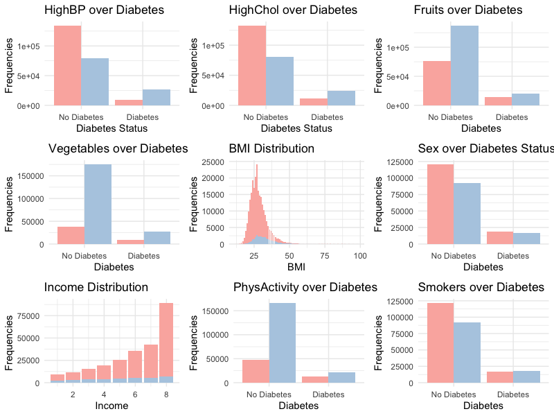

# Our Motivation

Type II Diabetes is a global health concern that affects more than 37 million Americans. By analyzing a comprehensive dataset from the Behavioral Risk Factor Surveillance System, we aim to uncover the correlations between diabetes prevalence and social and biological factors such as sex, education, income, bmi, smoking status and bioindicators like blood glucose and cholesterol levels. Through visualizations and statistical analysis in R, we aspire to highlight patterns that could inform better prevention and management strategies, thereby contributing to the broader dialogue on public health and policies related to diabetes.

This is a [resource](https://www.kaggle.com/datasets/alexteboul/diabetes-health-indicators-dataset/data) for our project.

Click to [learn more](Proposal.html) about our propopsal.

# Exploratory Data Analysis

There is an combined plots for our all variables.

Click to [learn more](EDA.html) about our EDA.

# Statistical Analysis

We applied ANOVA Test and Chi-squared test on our data.

Click to [learn more](statisticalanaylsis.html) about our statistics testing.

# Our members

  

Yimeng, Cai

(yc3577) 

  

Zheshu, Jiang

(zj2379) 

   

Ze, Li

(zl2746)  

Qianying, Wu

(qw2318)
